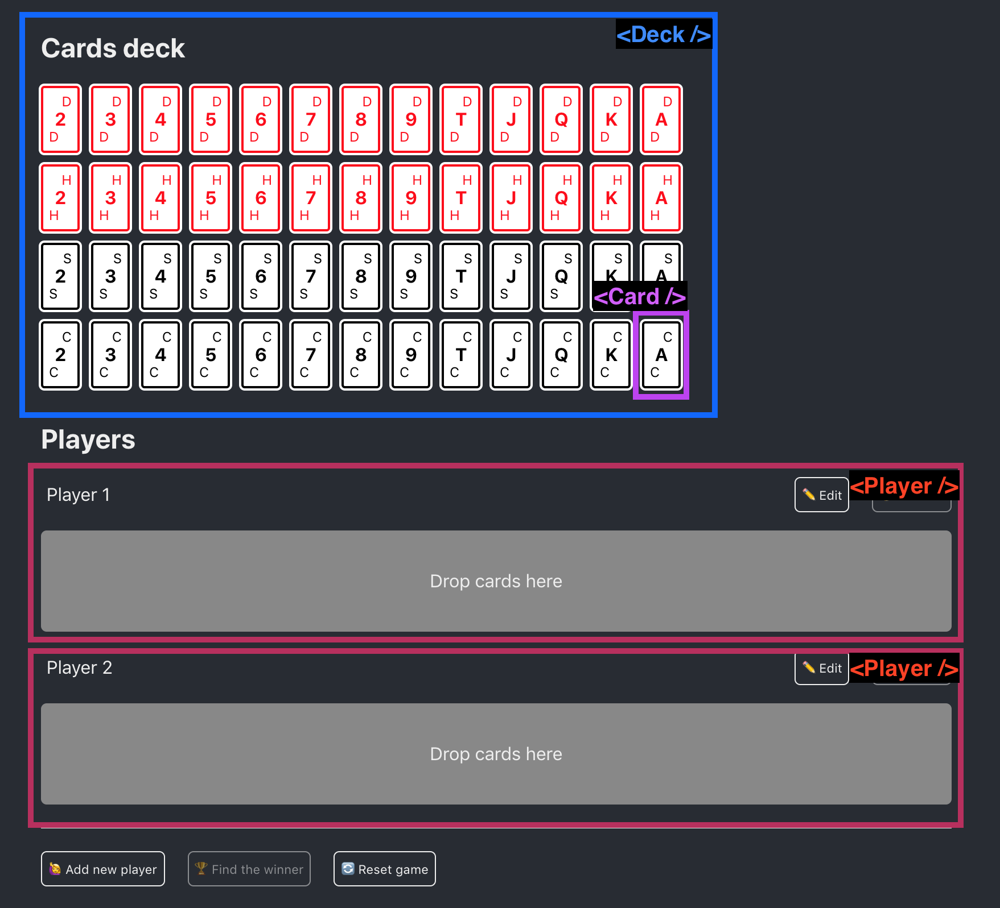
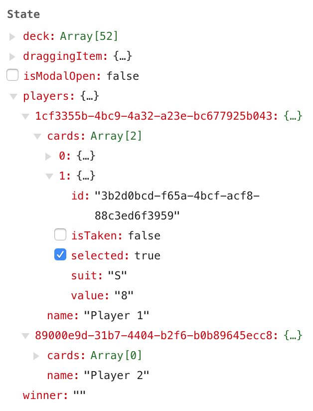
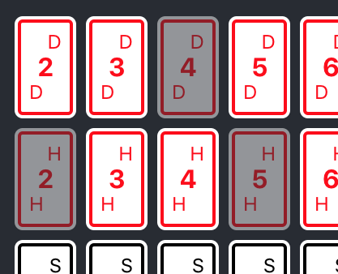

# Grabyo Poker

The objective was to create a poker application. The user interface was already built and my task was to make the whole thing functional.


|    | Requirements |
|----|--------------|
| ✅ | A game can have between 2 and 6 players |
| ✅ | You can add, remove, and edit a player |
| ✅ | Cards from the deck should be drag and droppable into a player's hand |
| ✅ | The same card can not be present in two players hand |
| ✅ | A card needs to be "selected" in the card deck if it is added to a player's hand |
| ✅ | You are free to display the winner the way you want after clicking on the "Find the winner" button |

###### * Drag and drop was since removed from the requirements, but I did it for fun

## Approach

Before I jumped right into coding, I spent some time identifying some areas to further investigate.

#### Picking Drag n Drop library
There were two packages that I was considering using for this project [`react-dnd`](https://github.com/react-dnd/react-dnd) and [`react-beautiful-dnd`](https://github.com/atlassian/react-beautiful-dnd). I chose `react-beautiful-dnd`, because it provides a basic set of functionality which I was looking for. It has a built-in keyboard and screen reader support, plus it makes use of wrapper components instead of higher-order components to build drag and drop interfaces, which I preferred.

#### Components
After I familiarized myself how `react-beautiful-dnd` works, I was able to identify the _fuctional/class_ components in my app. Which looks something like this:


###### * Styled components and the Modal are not included in this image

#### Data structure
I used `uuid` package to generate unique IDs for the players and cards, making the drag and drop functionality managable.



## Challenges

#### Copy card on drag
The core design idea of `react-beautiful-dnd` is physicality.
> we want users to feel like they are moving physical objects around

This meant that I wasn't able to copy-drag from the deck, which was a problem. Digging through the `react-beautiful-dnd` issues I found a guy who [solved this problem](https://github.com/atlassian/react-beautiful-dnd/issues/216#issuecomment-423708497) using this trick: while dragging a static item, it is rendered twice; one with injected properties and the other one without as a "ghost".



#### Deck grid
In the original implementation the Deck was created by iterating through the suits to create the rows and iterating through the values to create the columns. Since my `this.state.deck` was an array of 52 card objects, I didn't want to create a nested for-loop to achieve the desired effect, instead I used
```css
display: grid;
grid: grid-template-columns: repeat(13, 0fr);
```
...making the deck table 4x13.

## Next steps

#### Fix `<Card />` delete animation
Players can delete cards from their hands by dragging them outside. The functionality does work, it deletes the card, but the animation can be misleading, because after dragging and dropping the card outside, the card animates back to it's original place for a second, then it gets removed. This should be fixed.

#### Use `onBlur` event with `<form>`
Users can change the player's name by clicking the *Edit* button, then they can save it only if they click the *Save* button or hit *Enter*. If they click out then it cancels the name change.

The problem was that when the *Save* button was clicked the `onBlur` event fired before the `onClick` causing a wierd behaviour. 

The workaround was using `onMouseDown` on the button, becasuse it fires before the `onBlur`. 
```html
<PlayerName onBlur={this.handleInputBlur} ... />
<Button onMouseDown={this.saveNameChange}>...</Button>
```

However I'm not totally satisfied with this, maybe wrapping it in a `<form>` and giving the `onBlur` to it would be more elegant.
```html
<form onBlur={this.handleInputBlur} onSubmit={this.saveNameChange}>
  <PlayerName ... />
  <Button>...</Button>
<form/>
```


## Technical details

### Develop

To install dependencies

```
yarn
```

To start

```
yarn start
```

### Unit test

The tests are running using Jest and Enzyme

```
npm test
npm test -- --watch
```
